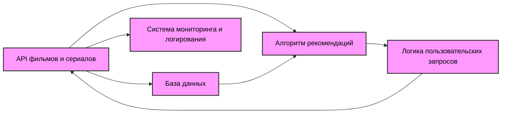

# Техническое задание ТЗ

Cтруктура ТЗ соответствует принципам IEEE 830 и адаптирована под Agile.

## 1.Введение

На основе собранных требований в файле requirements.md [Технические требования](Documentation/requirements.md) следующий этап разработки - проектирование архитектуры системы.
Составлено Техническое задание ТЗ, в котором описана схема взаимодействия всех компонентов системы, а также задокументированы алгоритмы рекомендаций и API.

## 2. Общие требования

Система рекомендаций контента предназначена для мультимедийной платформы, которая интегрирует несколько типов контента, таких как фильмы, сериалы, ТВ-каналы, спорт-трансляции и мультфильмы. Основной функцией системы является предоставление персонализированных рекомендаций контента на основе поведения пользователей на платформе.

## 3. Архитектура системы

Компоненты архитектуры системы:

1. **Модуль анализа предпочтений пользователей** — отслеживает историю просмотров и оценки пользователей
2. **Модуль рекомендаций** — использует алгоритмы (коллаборативная фильтрация и контентная фильтрация) для генерации рекомендаций
3. **API для интеграции с другими платформами** — получение данных о контенте с ТВ-платформ, спортивных каналов и других источников
4. **Консольный интерфейс** — для отображения рекомендаций и управления фильтрами

## 4. Алгоритм рекомендаций

Методы алгоритма рекомендаций:

### 4.1. **Коллаборативная фильтрация**:

- Использует информацию о предпочтениях пользователей для предложения контента на основе схожих интересов

<details>
<summary>Детали коллаборативной фильтрации:</summary>

#### 4.1.1. **Описание**:

- Коллаборативная фильтрация использует информацию о предпочтениях пользователей для предложения контента на основе схожих интересов. Это может быть полезно, когда у пользователя есть достаточно истории взаимодействий с платформой, и на основе этих данных можно предсказать, что ему понравится.
- Коллаборативная фильтрация — это метод, основанный на анализе поведения пользователей и нахождении схожих интересов между ними. Он использует данные о предыдущих оценках и действиях пользователей для того, чтобы рекомендовать контент, который понравился похожим пользователям.

#### 4.1.2. **Принцип работы**:

- Алгоритм анализирует данные других пользователей, которые имеют схожие интересы
- Рекомендуется контент, который был оценен и просмотрен схожими пользователями
- Подходит для пользователей с богатой историей взаимодействий на платформе

#### 4.1.3. **Метод**:

1. **Сотрудничество пользователей**: Для каждого пользователя анализируются действия других пользователей с схожими интересами и предпочтениями
2. **Матрица пользователь-контент**: Используется матрица, в которой строки представляют пользователей, а столбцы — контент. Ячейки этой матрицы будут содержать оценки или предпочтения пользователей по отношению к различным элементам контента (фильмы или сериалы)
3. **Поиск схожих пользователей**: Применяются алгоритмы для нахождения пользователей с наиболее схожими предпочтениями. Например, с помощью методов косинусного сходства или корреляции Пирсона можно вычислить, насколько сильно похожи два пользователя
4. **Рекомендации на основе схожести**: На основе найденных похожих пользователей система будет рекомендовать контент, который понравился этим пользователям, но еще не был просмотрен текущим пользователем

#### 4.1.4. **Преимущества**:

- Позволяет рекомендовать новый контент, который пользователь может не заметить
- Рекомендуется для случаев, когда у пользователя еще нет большого опыта на платформе

#### 4.1.5. **Ограничения**:

- Может страдать от проблемы **холодного старта**, когда система не имеет достаточного количества данных о новом пользователе
- Проблемы с масштабируемостью и производительностью при большом количестве пользователей

#### 4.1.6. **Пример кода коллаборативной фильтрации**:

```csharp
using System;
using System.Collections.Generic;
using System.Linq;

public class CollaborativeFiltering
{
    // Структура данных для хранения оценок пользователей
    private Dictionary<int, Dictionary<int, double>> userRatings = new Dictionary<int, Dictionary<int, double>>();

    public CollaborativeFiltering()
    {
        // Пример данных: ID пользователей и их оценки контента
        userRatings.Add(1, new Dictionary<int, double> { { 101, 5 }, { 102, 3 }, { 103, 4 } });
        userRatings.Add(2, new Dictionary<int, double> { { 101, 4 }, { 102, 5 }, { 103, 2 } });
        userRatings.Add(3, new Dictionary<int, double> { { 101, 2 }, { 102, 3 }, { 103, 5 } });
    }

    // Метод для вычисления сходства между пользователями по методу косинусного сходства
    public double CalculateCosineSimilarity(Dictionary<int, double> ratingsA, Dictionary<int, double> ratingsB)
    {
        var commonRatings = ratingsA.Keys.Intersect(ratingsB.Keys);
        double dotProduct = commonRatings.Sum(rating => ratingsA[rating] * ratingsB[rating]);
        double magnitudeA = Math.Sqrt(ratingsA.Values.Sum(v => v * v));
        double magnitudeB = Math.Sqrt(ratingsB.Values.Sum(v => v * v));
        return dotProduct / (magnitudeA * magnitudeB);
    }

    // Метод для получения рекомендаций
    public List<int> GetRecommendations(int userId)
    {
        var user = userRatings[userId];
        var similarities = new Dictionary<int, double>();

        foreach (var otherUserId in userRatings.Keys.Where(id => id != userId))
        {
            var otherUser = userRatings[otherUserId];
            double similarity = CalculateCosineSimilarity(user, otherUser);
            similarities.Add(otherUserId, similarity);
        }

        var similarUsers = similarities.OrderByDescending(s => s.Value).Take(2);
        var recommendedItems = new List<int>();

        foreach (var similarUser in similarUsers)
        {
            var otherUser = userRatings[similarUser.Key];
            foreach (var item in otherUser.Keys)
            {
                if (!user.ContainsKey(item)) // Если пользователь не оценил этот контент
                {
                    recommendedItems.Add(item);
                }
            }
        }

        return recommendedItems.Distinct().ToList();
    }
}

class Program
{
    static void Main()
    {
        var recommender = new CollaborativeFiltering();
        var recommendations = recommender.GetRecommendations(1);
        Console.WriteLine("Recommended items for user 1: " + string.Join(", ", recommendations));
    }
}
```

- В примере кода коллаборативной фильтрации реализован метод для вычисления косинусного сходства между пользователями и рекомендация контента на основе схожих предпочтений, данный пример кода является базовым и может быть расширен в зависимости от потребности системы (добавление работы с базой данных или улучшение логики фильтрации).
    </details>

### 4.2. **Контентная фильтрация**:

- Рекомендует контент, исходя из жанра и других характеристик (популярность, рейтинг)

<details>
<summary>Детали контентной фильтрации:</summary>

#### 4.2.1. **Описание:**

Контентная фильтрация делает рекомендации, основываясь на характеристиках контента, с которым пользователь уже взаимодействовал. Это может быть жанр, популярность, рейтинг, актеры, режиссеры, год выпуска и другие атрибуты.

#### 4.2.2. **Метод:**

- **Анализ характеристик контента:** Для каждого контента (фильмов, сериалов, ТВ-каналов и т.д.) создаются метки или атрибуты, которые описывают его особенности, например, жанр, рейтинг, ключевые слова и т.д
- **Поиск схожих элементов контента:** Когда пользователь просматривает контент, система ищет другие элементы, которые имеют схожие характеристики, и предлагает их пользователю
- **Рекомендации по схожести контента:** Например, если пользователь часто смотрит фильмы в жанре экшн с высоким рейтингом, система предложит другие экшн-фильмы с хорошими отзывами

#### 4.2.3. **Преимущества:**

- Решает проблему холодного старта, так как даже новый пользователь может получать рекомендации на основе контента, который он просмотрел.
- Рекомендует контент, который точно соответствует интересам пользователя.

#### 4.2.4. **Ограничения:**

- Может не учитывать "неочевидные" предпочтения пользователя (например, интерес к жанрам или темам, которые не были явно выражены в истории просмотров).

#### 4.2.5. **Пример кода контентной фильтрации:**

```csharp
using System;
using System.Collections.Generic;
using System.Linq;

public class ContentFiltering
{
    // Структура данных для хранения контента с его характеристиками
    private Dictionary<int, Dictionary<string, string>> contentAttributes = new Dictionary<int, Dictionary<string, string>>();

    public ContentFiltering()
    {
        // Пример данных: контент с атрибутами (например, жанр, рейтинг)
        contentAttributes.Add(101, new Dictionary<string, string> { { "genre", "Action" }, { "rating", "5" } });
        contentAttributes.Add(102, new Dictionary<string, string> { { "genre", "Comedy" }, { "rating", "4" } });
        contentAttributes.Add(103, new Dictionary<string, string> { { "genre", "Action" }, { "rating", "4" } });
    }

    // Метод для получения рекомендаций на основе контента
    public List<int> GetRecommendations(int userId)
    {
        var userPreferredGenre = "Action"; // Пример предпочтений пользователя
        var recommendedItems = new List<int>();

        foreach (var content in contentAttributes)
        {
            if (content.Value["genre"] == userPreferredGenre)
            {
                recommendedItems.Add(content.Key);
            }
        }

        return recommendedItems;
    }
}

class Program
{
    static void Main()
    {
        var recommender = new ContentFiltering();
        var recommendations = recommender.GetRecommendations(1);
        Console.WriteLine("Recommended items based on content for user 1: " + string.Join(", ", recommendations));
    }
}

```

- В примере кода контентной фильтрации рекомендации строятся на основе атрибутов контента (жанр, рейтинг и др.). Данный пример кода является базовым и может быть расширен в зависимости от потребности системы (добавление работы с базой данных или улучшение логики фильтрации).
  </details>

### 4.3 **Смешанный подход**:

- Комбинированное использование обеих фильтраций для более точных рекомендаций

<details>
<summary>Детали смешанного подхода:</summary>

#### 4.3.1. **Описание:**

Смешанный подход комбинирует элементы коллаборативной и контентной фильтрации для получения более точных рекомендаций. Этот подход позволяет избежать ограничений каждого метода и предоставляет более персонализированные рекомендации.

#### 4.3.2. **Метод:**

- **Интеграция коллаборативной и контентной фильтрации:** Система будет использовать обе фильтрации одновременно и комбинировать их результаты для формирования окончательной рекомендации. Например, сначала могут быть получены рекомендации по контентной фильтрации, а затем фильтры коллаборативной фильтрации будут использоваться для уточнения предложений
- **Взвешенные рекомендации:** Для каждой рекомендации будет вычисляться вес, который будет учитывать важность каждого из методов (например, если коллаборативная фильтрация дает более релевантные результаты для пользователя, то ее рекомендации получат больший вес).

#### 4.3.3. **Преимущества:**

- Устраняет ограничения коллаборативной и контентной фильтрации по отдельности
- Предоставляет более точные и персонализированные рекомендации

#### 4.3.4. **Ограничения:**

- Требует больше вычислительных ресурсов для обработки и комбинации результатов
- Необходимость в сложной настройке для оптимизации веса методов

#### 4.3.5. **Пример кода смешанного подхода:**

```csharp
using System;
using System.Collections.Generic;
using System.Linq;

public class MixedFiltering
{
    private CollaborativeFiltering collaborativeFiltering;
    private ContentFiltering contentFiltering;

    public MixedFiltering()
    {
        collaborativeFiltering = new CollaborativeFiltering();
        contentFiltering = new ContentFiltering();
    }

    // Метод для получения рекомендаций с использованием смешанного подхода
    public List<int> GetRecommendations(int userId, string method)
    {
        if (method == "collaborative")
        {
            return collaborativeFiltering.GetRecommendations(userId);
        }
        else if (method == "content")
        {
            return contentFiltering.GetRecommendations(userId);
        }
        else if (method == "mixed")
        {
            var collaborativeRecommendations = collaborativeFiltering.GetRecommendations(userId);
            var contentRecommendations = contentFiltering.GetRecommendations(userId);
            return collaborativeRecommendations.Concat(contentRecommendations).Distinct().ToList();
        }

        return new List<int>();
    }
}

class Program
{
    static void Main()
    {
        var recommender = new MixedFiltering();
        var recommendations = recommender.GetRecommendations(1, "mixed");
        Console.WriteLine("Mixed recommendations for user 1: " + string.Join(", ", recommendations));
    }
}

```

- В примере кода смешанного подхода метод получения рекомендаций объединяет результаты обоих методов коллаборативной и контентной фильтрации, предлагая более разнообразные рекомендации. Данный пример кода является базовым и может быть расширен в зависимости от потребности системы (добавление работы с базой данных или улучшение логики фильтрации).
  </details>

### 4.4 **Применение алгоритма**:

- Рекомендации генерируются путем выполнения алгоритмов в зависимости от данных о пользователе и контексте

  - **Для нового пользователя** (без истории действий) применяется **контентная фильтрация**, основываясь на жанрах и характеристиках контента
  - **Для активных пользователей**, у которых есть история просмотров, применяется **коллаборативная фильтрация**, чтобы рекомендовать контент, который понравился похожим пользователям
  - **Смешанный подход** применяется, когда необходимо объединить результаты обоих методов для повышения точности

- **Выборочное применение (основной подход)**: проще для начала, более гибкое, позволяет быстро адаптировать систему к пользовательскому контексту
- **Последовательное применение (смешанный подход)**: более сложный, но может дать более точные рекомендации в большинстве случаев, поскольку комбинируются лучшие качества двух методов

### 4.5 **Пример реализации алгоритма**:

**Пример запроса:** Чтобы получить рекомендации, система может делать запросы к базе данных или API с учетом следующих параметров:

```http
GET /api/v1/recommendations?user_id=123&method=collaborative
GET /api/v1/recommendations?user_id=123&method=content
GET /api/v1/recommendations?user_id=123&method=mixed
```

Где:

- `user_id` — ID пользователя для получения персонализированных рекомендаций
- `method` — метод фильтрации (коллаборативный, контентный или смешанный)

## 5. Взаимодействие с API

- Система взаимодействует с внешними API для получения данных о контенте: cписок фильмов, сериалов, ТВ-каналов и спортивных трансляций.
  Система использует несколько API для получения информации о контенте (TMDb, TVMaze, SportRadar).

- Интеграция с API в C# реализована через использование HttpClient для отправки HTTP-запросов и Newtonsoft.Json для десериализации JSON-ответов в объекты C#.

- Для интеграции с внешними сервисами (TMDb, TVMaze, SportRadar) система использует RESTful API с методами GET для получения информации о контенте. Каждый запрос к API выполняется с использованием `HttpClient` в C# и стандартной аутентификации через API-ключ.

- **Методы запросов**: GET
- **Формат ответа**: JSON
- **Обработка ошибок**: В случае ошибки при запросе, система использует кэшированные данные или предпринимает повторную попытку через заданный интервал (через 5 секунд). Ошибки типа `HttpRequestException` обрабатываются с соответствующим логированием.

### 5.1. **API для фильмов и сериалов**:

- Позволяет получать данные о названиях, жанрах, описаниях, рейтингах, годах выпуска

<details>
<summary>Детали API для фильмов и сериалов:</summary>

#### 5.1.1. **Поставщик:**

- [TMDb (The Movie Database) API](https://www.themoviedb.org/documentation/api)

#### 5.1.2. **Данные:**

- Название
- Жанры
- Описание
- Рейтинг
- Год выпуска
- Актерский состав

#### 5.1.3. **Аутентификация:**

- Для доступа используется API-ключ, который предоставляется в каждом запросе. Для доступа необходимо зарегистрироваться на платформе и получить уникальный ключ.

#### 5.1.4. **Частота обновлений:**

- Данные о контенте, популярных фильмах и сериалах обновляются ежедневно 1 раз в сутки. Используется RESTful API, запросы могут быть отправлены через HTTP GET-запросы.

#### 5.1.5. **Методы запроса:**

- Пример запроса для получения списка популярных фильмов:

```http
GET https://api.themoviedb.org/3/movie/popular?api_key=your_api_key&language=ru-RU
```

- Пример взаимодействия API на C#:

```csharp
class Program
{
    static async Task Main(string[] args)
    {
        // API-ключ
        string apiKey = "your_api_key";
        string url = $"https://api.themoviedb.org/3/movie/popular?api_key={apiKey}&language=ru-RU";

        using (HttpClient client = new HttpClient())
        {
            // Отправка GET-запроса
            HttpResponseMessage response = await client.GetAsync(url);

            if (response.IsSuccessStatusCode)
            {
                // Получаем ответ в формате JSON
                string jsonResponse = await response.Content.ReadAsStringAsync();

                // Десериализация JSON в объекты C#
                var movieData = JsonConvert.DeserializeObject<MovieResponse>(jsonResponse);

                // Обработка полученных данных
                foreach (var movie in movieData.Results)
                {
                    Console.WriteLine($"Title: {movie.Title}, Rating: {movie.VoteAverage}");
                }
            }
            else
            {
                Console.WriteLine("Ошибка запроса: " + response.StatusCode);
            }
        }
    }
}

// Классы для десериализации JSON-ответа
public class MovieResponse
{
    [JsonProperty("results")]
    public List<Movie> Results { get; set; }
}

public class Movie
{
    [JsonProperty("title")]
    public string Title { get; set; }

    [JsonProperty("vote_average")]
    public double VoteAverage { get; set; }
}

```

- Пример ответа:

```json
{
  "page": 1,
  "results": [
    {
      "id": 299534,
      "title": "Avengers: Endgame",
      "overview": "After the devastating events of Avengers: Infinity War...",
      "release_date": "2019-04-26",
      "vote_average": 8.4,
      "genres": ["Action", "Adventure", "Science Fiction"]
    },
    {
      "id": 299537,
      "title": "Captain Marvel",
      "overview": "Carol Danvers becomes one of the universe's most powerful heroes...",
      "release_date": "2019-03-08",
      "vote_average": 7.0,
      "genres": ["Action", "Adventure", "Science Fiction"]
    }
  ]
}
```

#### 5.1.6. **Ограничения:**

- API позволяет делать до 40 запросов в минуту для каждого ключа. Для обеспечения стабильности системы реализовано кеширование запросов.

#### 5.1.7. **Диаграмма компонентов:**



<details>
<summary>Диаграмма компонентов системы:</summary>


</details>
- Описание диаграммы компонентов:

- **API для фильмов, сериалов (A)** — компонент, который обрабатывает запросы от пользователя на получение списка фильмов, сериалов
- **База данных (B)** — хранит данные о фильмах, сериалах, пользователях и их предпочтениях
- **Алгоритм рекомендаций (C)** — принимает данные из базы данных и API, анализирует их и генерирует рекомендации
- **Логика пользовательских запросов (D)** — интерфейс взаимодействия с пользователем через консоль
- **Система мониторинга и логирования (E)** — помогает отслеживать запросы, ошибки и производительность
</details>

### 5.2. **API для ТВ-каналов:**

- Для получения данных о ТВ-каналах и расписаниях трансляций используется API, предоставляющее информацию о текущих и предстоящих трансляциях.

<details>
<summary>Детали API для ТВ-каналов:</summary>

#### 5.2.1. **Поставщик:**

- [TVMaze API](https://www.tvmaze.com/api)

#### 5.2.2. **Данные:**

- Список каналов
- Расписания трансляций
- Жанры программ

#### 5.2.3. **Аутентификация:**

- Не требует аутентификации, доступно через открытый API. Для доступа используется API-ключ.

#### 5.2.4. **Частота обновлений:**

- Данные о расписании обновляются каждую минуту, так как расписания трансляций могут изменяться.

#### 5.2.5. **Методы запроса:**

- Пример запроса для получения информации о текущих трансляциях:

```http
GET https://api.tvmaze.com/schedules?country=US&date=2025-03-01
```

- Пример взаимодействия API на C#:

```csharp
class Program
{
    static async Task Main(string[] args)
    {
        // API-ключ, если нужен
        string url = "https://api.tvmaze.com/schedules?country=US&date=2025-03-01";

        using (HttpClient client = new HttpClient())
        {
            // Отправка GET-запроса
            HttpResponseMessage response = await client.GetAsync(url);

            if (response.IsSuccessStatusCode)
            {
                // Получаем ответ в формате JSON
                string jsonResponse = await response.Content.ReadAsStringAsync();

                // Десериализация JSON в объекты C#
                var scheduleData = JsonConvert.DeserializeObject<List<TVShow>>(jsonResponse);

                // Обработка полученных данных
                foreach (var show in scheduleData)
                {
                    Console.WriteLine($"Show: {show.Show.Name}, Channel: {show.Network.Name}, Air Time: {show.Airtime}");
                }
            }
            else
            {
                Console.WriteLine("Ошибка запроса: " + response.StatusCode);
            }
        }
    }
}

// Классы для десериализации JSON-ответа
public class TVShow
{
    [JsonProperty("show")]
    public Show Show { get; set; }

    [JsonProperty("network")]
    public Network Network { get; set; }

    [JsonProperty("airtime")]
    public string Airtime { get; set; }
}

public class Show
{
    [JsonProperty("name")]
    public string Name { get; set; }
}

public class Network
{
    [JsonProperty("name")]
    public string Name { get; set; }
}

```

- Пример ответа:

```json
[
  {
    "show": {
      "id": 1,
      "name": "The Simpsons",
      "genres": ["Animation", "Comedy"]
    },
    "airtime": "2025-03-01T18:00:00Z",
    "network": {
      "name": "FOX"
    }
  },
  {
    "show": {
      "id": 2,
      "name": "Breaking Bad",
      "genres": ["Drama", "Thriller"]
    },
    "airtime": "2025-03-01T20:00:00Z",
    "network": {
      "name": "AMC"
    }
  }
]
```

#### 5.2.6. **Ограничения:**

- В случае высокой нагрузки или изменений расписаний, API может быть недоступным. Будет реализована обработка ошибок и уведомления пользователей. Если данные не могут быть получены (например, из-за недоступности API), система будет использовать последние доступные данные из кэша.
</details>

### 5.3. **API для спортивных событий:**

- Для получения данных о спортивных событиях и трансляциях используется API, предоставляющее информацию о матчах, турнирах, командах и результатах.

<details>
<summary>Детали API для спортивных событий:</summary>

#### 5.3.1. **Поставщик:**

- [SportRadar API](https://sportradar.com/media-tech/data-content/sports-data-api/)

#### 5.3.2. **Данные:**

- Расписание спортивных событий
- Информация о командах и турнирах

#### 5.3.3. **Аутентификация:**

- API требует ключа доступа для каждого запроса, который предоставляется при регистрации. Для доступа используется OAuth 2.0 для авторизации.

#### 5.3.4. **Частота обновлений:**

- Информация о матчах и трансляциях обновляется в реальном времени.

#### 5.3.5. **Методы запроса:**

- Пример запроса для получения информации о спортивном событии:

```http
GET https://api.sportradar.us/sports-api/v1/events?api_key=your_api_key
```

- Пример ответа:

```json
{
  "events": [
    {
      "event_id": "12345",
      "sport": "Football",
      "teams": ["Team A", "Team B"],
      "start_time": "2025-03-01T15:00:00Z",
      "status": "Scheduled"
    },
    {
      "event_id": "12346",
      "sport": "Basketball",
      "teams": ["Team C", "Team D"],
      "start_time": "2025-03-01T17:30:00Z",
      "status": "Scheduled"
    }
  ]
}
```

#### 5.3.6. **Ограничения:**

- Максимум 100 запросов в минуту для каждого API-ключа.
</details>

### 5.4. **Рейтинги и отзывы пользователей**

### 5.5. **Информация о новинках и расписаниях (для ТВ-каналов и спортивных событий)**

### 5.6. **Обработка ошибок и исключений**

- Если API не доступно, система должна автоматически делать повторные попытки с заданным интервалом или использовать кэшированные данные.

- Пример:

```csharp
try
{
    HttpResponseMessage response = await client.GetAsync(url);
    response.EnsureSuccessStatusCode(); // Бросит исключение, если статус не успешен
    string jsonResponse = await response.Content.ReadAsStringAsync();
}
catch (HttpRequestException e)
{
    Console.WriteLine("Ошибка запроса: " + e.Message);
}
catch (Exception e)
{
    Console.WriteLine("Ошибка: " + e.Message);
}
```

### 5.7. **Ограничения API и управление лимитами**

- Для предотвращения превышения лимитов запросов система использует механизмы кеширования или очереди для управления частотой запросов.

- **Кэширование**: данные, полученные из API, кэшируются на сервере с сроком действия, после чего выполняется обновление.
- **Реализация очередей**: для управления частотой запросов к API, система использует очередь запросов с контролем частоты их выполнения.

### 5.8. **Кэширование данных**

- Кэширование данных о контенте используется для уменьшения частоты запросов к внешним API и обеспечения более быстрого отклика системы. Система обновляет данные о контенте каждую ночь (каждые 24 часа) автоматически с использованием внешнего API. В случае недоступности API, система использует последние доступные данные из кэша.

- **Тип кэширования**: Кэширование данных о контенте осуществляется с использованием **локального кэширования на сервере** или **кэширования в базе данных**, в зависимости от конфигурации системы. Это уменьшает количество повторных запросов к внешним API и ускоряет обработку запросов от пользователей

- **Срок хранения данных**: Все данные, полученные от внешних API, хранятся в кэше **24 часа**. После этого данные считаются устаревшими, и система выполняет новый запрос к API для получения актуальной информации, это гарантирует, что данные будут всегда актуальными и соответствующими последним изменениям

- **Обновление данных**: Кэшированные данные обновляются автоматически каждый день (каждые 24 часа) в **период ночного обновления системы**. В случае, если API временно недоступно или произошла ошибка при запросе, система будет использовать последние доступные данные из кэша. Это гарантирует, что пользователи всегда будут получать информацию, даже в случае временных сбоев с внешними сервисами

- **Обновление данных при изменении версии API**: При изменении версии API (переход с /v1/ на /v2/), система автоматически обновляет запросы и данные, с учетом новой версии API. Это позволяет избежать проблем с несовместимостью данных и обеспечивает правильную работу системы при изменениях внешнего сервиса

### 5.9. **Политики безопасности для взаимодействия с API**

- Все взаимодействия с внешними API выполнены через защищенное соединение (HTTPS), аутентификация осуществляется с использованием токенов доступа или ключей API.

- Для обеспечения безопасности ключи хранятся в переменных окружения или в безопасных хранилищах, а не в коде.

### 5.10. **Версионирование API**

- Версионирование API — это механизм, позволяющий управлять изменениями в API и обеспечивать совместимость с предыдущими версиями, чтобы избежать разрушительных изменений в работе системы. При изменении структуры данных или методов запросов важно предусмотреть систему версионирования, чтобы пользователи и сервисы могли продолжать работать с устаревшими версиями API, пока не будут обновлены или адаптированы

- Каждое взаимодействие с API учитывает его версию, для предотвращения возможных ошибок при изменении структуры данных или методов запросов в будущем

- В случае изменения версии API проводится адаптация системы через тестирование интеграции и обновление обработчиков запросов

- В проекте выбран способ версионирования через URL, так как версия API сразу видна в URL, что облегчает управление и поддержку нескольких версий, а также позволяет поддерживать несколько версий API одновременно и не нарушать работу системы при выходе новой версии,плюс, это - один из наиболее простых и понятных методов версионирования.

- Стабильные версии: после выпуска новой версии API, старые версии будут поддерживаться в течение определенного времени, например, 12 месяцев. Это позволит пользователям постепенно адаптировать свои системы к новым версиям.

- Обратная совместимость: для обеспечения обратной совместимости в новых версиях API, старая структура данных и методы запросов остаются доступными, если это возможно. В случае значительных изменений в данных или функциональности, может потребоваться выпуск новой версии API.

- Обновления и миграция: все изменения в API (добавление новых параметров или изменение структуры данных) анонсируются заранее через систему уведомлений. (Рекомендуется тестировать старые и новые версии API на этапе интеграционного тестирования, чтобы убедиться, что система продолжает работать с предыдущими версиями API).

- **Пример**:

  - Запрос на получение списка фильмов в первой версии API:
    ```http
    GET https://api.themoviedb.org/v1/movie/popular?api_key=your_api_key
    ```
  - Запрос на получение списка фильмов во второй версии API:
    ```http
    GET https://api.themoviedb.org/v2/movie/popular?api_key=your_api_key
    ```

### 5.11. **Тестирование взаимодействия с API**

- Проведение интеграционного тестирования взаимодействия с каждым API, чтобы удостовериться, что данные получаются корректно и система правильно обрабатывает ответы.

Взаимодействие с API должно быть протестировано на нескольких уровнях:

- Проверка успешных и неуспешных запросов
- Обработка ошибок (например, 404, 500, превышение лимита запросов)
- Правильность десериализации данных
- Обработка кэшированных данных, если API недоступно

### 5.12 **Обеспечение API**:

- Стандартные запросы для получения контента
- Обновление данных в реальном времени для обеспечения актуальности рекомендаций

Пример запроса:

```http
GET /api/v1/movies?genre=action&rating=8.0
```

## 6. Технические детали

### 6.1. База данных

Для хранения данных используется реляционная база данных (PostgreSQL), которая хранит:

- Информацию о пользователях
- Данные о контенте (фильмы, сериалы, спорт-трансляции, ТВ-контент, мультфильмы)
- Историю просмотров и оценки пользователей

### 6.2. Алгоритм рекомендаций

Механизм работы алгоритма рекомендаций:

1. Система анализирует данные о действиях пользователя
2. Применяется коллаборативная фильтрация для нахождения похожих пользователей
3. Используется контентная фильтрация для уточнения рекомендаций
4. Рекомендации сортируются и выводятся в консоль

### 6.3. Безопасность и защита данных

Система должна обеспечивать защиту персональных данных пользователей, включая:

- Шифрование данных (с использованием SSL/TLS)
- Аутентификацию и авторизацию через (OAuth)
- Соблюдение законодательства о защите данных (GDPR)

## 7. **User Stories**

Для обеспечения ясности требований и фокусировки на пользователе, представлены ключевые **User Stories**, которые описывают, как пользователи будут взаимодействовать с системой рекомендаций:

### 7.1. Получение персонализированных рекомендаций

<details>
<summary>Как пользователь, я хочу получать персонализированные рекомендации</summary>

**Как пользователь**, я хочу получать персонализированные рекомендации, чтобы легко находить контент, соответствующий моим интересам.

- **Acceptance Criteria**:
  - Система отслеживает историю просмотров и предпочтения пользователя
  - На основе этих данных генерируются персонализированные рекомендации

</details>

---

### 7.2. Фильтрация контента по жанрам

<details>
<summary>Как пользователь, я хочу фильтровать контент по жанрам</summary>

**Как пользователь**, я хочу фильтровать контент по жанрам, чтобы видеть только те фильмы и программы, которые мне интересны.

- **Acceptance Criteria**:
  - В интерфейсе есть возможность фильтровать контент по жанрам (драма, экшн, фантастика и т.д.)
  - Рекомендации отображаются в соответствии с выбранным фильтром

</details>

---

### 7.3. Сортировка контента по рейтингу

<details>
<summary>Как пользователь, я хочу сортировать контент по рейтингу</summary>

**Как пользователь**, я хочу сортировать контент по рейтингу, чтобы увидеть лучшие фильмы и шоу.

- **Acceptance Criteria**:
  - В интерфейсе имеется опция сортировки контента по рейтингу (топ-10)
  - Пользователь может выбрать сортировку по популярности или рейтингу

</details>

---

### 7.4. Получение рекомендаций в реальном времени

<details>
<summary>Как пользователь, я хочу получать рекомендации в реальном времени</summary>

**Как пользователь**, я хочу получать рекомендации в реальном времени, чтобы всегда видеть актуальные предложения.

- **Acceptance Criteria**:
  - Рекомендации обновляются при изменении истории просмотров или оценок
  - Пользователь получает актуальные рекомендации в течение нескольких секунд

</details>

---

### 7.5. Фильтрация контента по новизне

<details>
<summary>Как пользователь, я хочу фильтровать контент по новизне</summary>

**Как пользователь**, я хочу фильтровать контент по новизне, чтобы смотреть только новые фильмы или сериалы.

- **Acceptance Criteria**:
  - Возможность фильтровать контент по дате выхода (новинки, свежие выпуски)
  - Отображение только контента, который был выпущен недавно

</details>

---

### 7.6. Рекомендации на основе схожих интересов других пользователей

<details>
<summary>Как пользователь, я хочу, чтобы система рекомендовала мне контент на основе схожих интересов других пользователей</summary>

**Как пользователь**, я хочу, чтобы система рекомендовала мне контент на основе схожих интересов других пользователей, чтобы находить новое и интересное.

- **Acceptance Criteria**:
  - Система анализирует действия других пользователей с похожими интересами и предлагает схожие рекомендации

</details>

---

## 8. Тестирование

### 8.1. Модульное тестирование

Для каждого компонента системы разработано модульное тестирование с использованием фреймворка для юнит-тестов (NUnit)

- Тесты для алгоритмов фильтрации (правильность рекомендаций по схожим пользователям)
- Тесты на производительность (время отклика при запросе рекомендаций)

### 8.2. Интеграционное тестирование

Планируется проведение интеграционных тестов для проверки правильности взаимодействия компонентов системы (взаимодействие с API и получение рекомендаций).

- **Проверка успешных запросов**: тестирование корректности получения данных от API (запросы на TMDb, TVMaze и SportRadar)
- **Обработка ошибок API**: тестирование реакции системы на ошибки, такие как 404, 500 или превышение лимита запросов (статус 429)
- **Тестирование на кэширование**: проверка работы с кэшированными данными, когда API недоступно
- **Производительность**: тестирование времени отклика системы при высоких нагрузках
- **Инструменты**: тестирование будет выполняться с использованием инструментов, таких как Postman для API-тестирования, и NUnit для проверки функционала

### 8.3. Тестирование производительности

- Оценка времени отклика системы при взаимодействии с API
- Тестирование системы при высоком объеме запросов к API для проверки стабильности работы

## 9. Заключение

Данное техническое задание ТЗ является основой для реализации системы рекомендаций контента. В рамках проекта применены методы анализа предпочтений пользователей, фильтрации контента и использование внешних API для интеграции с другими платформами (мобильными приложениями, ТВ-платформами). Система должна обеспечивать высокую производительность, масштабируемость и устойчивость к сбоям, обеспечивая при этом качественный пользовательский опыт.
