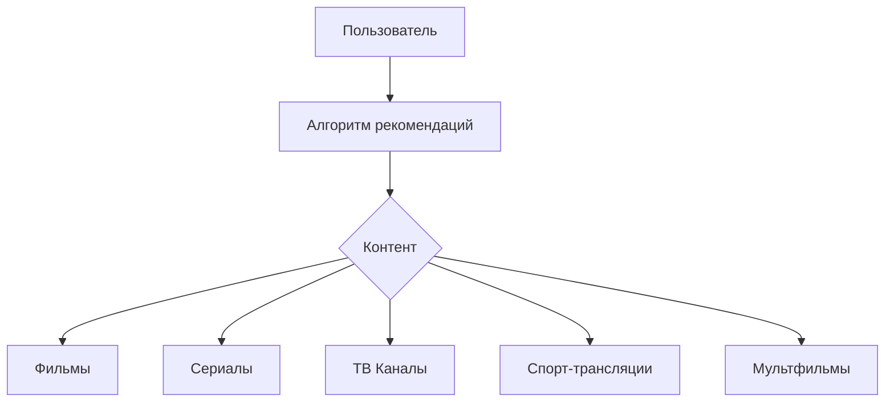

# ContentRecommendationSystem

**ContentRecommendationSystem** - Система рекомендаций контента для мультимедийной платформы.
Данный проект выполнен как <span style="font-size:16px; color:lightblue; font-style:italic;">Console Application</span>
консольное приложение для создания системы рекомендаций контента, так как это начальная версия MVP (Minimal Viable Product), сосредоточенная на бизнес-логике (алгоритмах рекомендаций без интерфейса).

## Описание

Система рекомендаций контента для мультимедийной платформы, которая включает
<span style="color:red; font-style:italic;">Фильмы</span>
<span style="color:orange; font-style:italic;">Сериалы</span>
<span style="color:yellow; font-style:italic;">ТВ-каналы</span>
<span style="color:lightgreen; font-style:italic;">Спорт-трансляции</span>
<span style="color:lightblue; font-style:italic;">Мультфильмы</span> и т.д.,
она анализирует и использует предпочтения пользователей для предоставления персонализированных рекомендаций, на основе их предыдущих действий, жанровых предпочтений и поведения на платформе.

## Стек технологий

- **C#**
- **.NET 8.0**
- **Visual Studio 2022**

## Архитектура системы



## Структура проекта

- **Исходный код**: Реализация системы рекомендаций на **C#**
- **Документация**: Описание требований, ТЗ и диаграмм
- **Тестирование**: Скрипты для тестирования, отчеты

## Установка

1. Клонировать репозиторий:
   ```bash
   git clone https://github.com/senia1/ContentRecommendationSystem.git
   ```

## Инструкции по запуску

1. Клонируйте репозиторий
2. Откройте файл `ContentRecommendationSystem.sln` в **Visual Studio 2022**
3. Запустите проект
