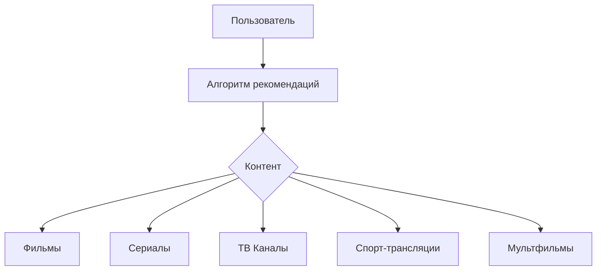

# ContentRecommendationSystem

Pet Project в домене MediaTech выполнен как <span style="font-size:16px; color:lightblue; font-style:italic;">Console Application</span>
консольное приложение для создания системы рекомендаций контента, так как это начальная версия MVP (Minimal Viable Product), сосредоточенная на бизнес-логике (алгоритмах рекомендаций без интерфейса) для демонстрации навыков на позицию Системного аналитика:

- Сбор и документирование требований;
- Составление ТЗ (Технического задания);
- Визуализация и моделирование бизнес-процессов с использованием UML, Mermaid.js;
- Описание интеграций с помощью веб-сервисов и API;

## Описание

Система рекомендаций контента для мультимедийной платформы, которая включает
<span style="color:red; font-style:italic;">Фильмы</span>
<span style="color:orange; font-style:italic;">Сериалы</span>
<span style="color:yellow; font-style:italic;">ТВ-каналы</span>
<span style="color:lightgreen; font-style:italic;">Спорт-трансляции</span>
<span style="color:lightblue; font-style:italic;">Мультфильмы</span> и т.д.,
она анализирует и использует предпочтения пользователей для предоставления персонализированных рекомендаций, на основе их предыдущих действий, жанровых предпочтений и поведения на платформе.

## Стек технологий

- **C#**
- **.NET 8.0**
- **Visual Studio 2022**

## Архитектура системы



## Структура проекта

структура проекта **ContentRecommendationSystem**:

```
ContentRecomendationSystem/
│
├── ContentRecommendationSystem/                        # Исходный код проекта
│ ├── ContentRecommendationSystem.csproj                # Файл проекта
│ ├── Program.cs                                        # Главный файл программы
│ ├── ContentRecommendationSystem.cs                    # Другие файлы кода (класс для рекомендаций и др.)
| ├── DatabaseService.cs                                # Класс для работы с базой данных
│ ├── RecommendationEngine.cs                           # Логика рекомендаций
│ ├── UserPreferences.cs                                # Класс для хранения предпочтений пользователя
│ ├── GoogleAuth.cs                                     # Класс для авторизации через Google
│ ├── User.cs                                           # Класс пользователя
│ └── [другие файлы проекта]                            # Остальные файлы проекта (классы, утилиты)
│
├── Documentation/                                      # Папка для документации
│ ├── requirements.md                                   # Описание требований
│ ├── technical_specification.md                        # Техническое задание (ТЗ)
│ ├── diagrams/                                         # Папка для диаграмм
│ │ └── recommendation_diagram.svg                      # Диаграмма системы рекомендаций
│ │ └── component_diagram.svg                           # Диаграмма компонентов
│ │ └── preferences_analysis_diagram.svg                # Диаграмма анализа предпочтений
│ │ └── classes_diagram.svg                             # Диаграмма классов
│ │ └── er_diagram.svg                                  # Диаграмма ER
│
├── tests/                                              # Папка для тестов
│ ├── test_suites/                                      # Скрипты для тестирования
│ │ └── [тесты и отчеты]                                # Тесты и отчет о тестировании
│
├── ContentRecommendationSystem.sln                     # Файл решения для Visual Studio
├── .gitignore                                          # Файл для игнорирования
├── .gitattributes                                      # Файл для атрибутов Git
├── README.md                                           # Главный README файл
```

## Установка

1. Клонировать репозиторий:
   ```bash
   git clone https://github.com/senia1/ContentRecommendationSystem.git
   ```

## Инструкции по запуску

1. Клонируйте репозиторий
2. Откройте файл `ContentRecommendationSystem.sln` в **Visual Studio 2022**
3. Запустите проект
